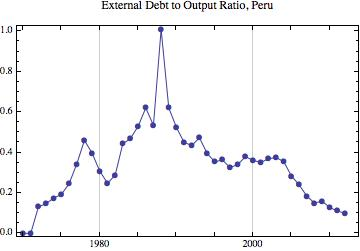
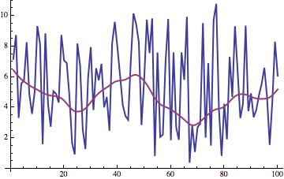
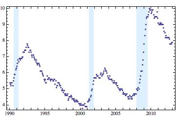
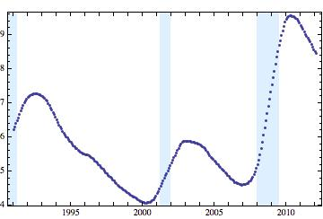
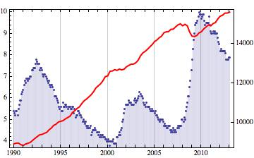

# README #

A collection of useful Mathematica functions to access FRED, access the World Bank online database. It also contains functions to make DateListPlots with shaded regions and DateListPlots with two vertical axes. It also provides some basic manipulation of time series (mapThread, moving average, and HP filtering). 

To install Mathematica packages see [here](http://support.wolfram.com/kb/5648) and [here](http://mathematica.stackexchange.com/questions/669/how-to-install-packages).

## Time Series Package ##
    Needs["TimeSeries`"]

### Using FRED ###
    initializeFRED["INSERT YOUR API KEY HERE"] 
Alternatively, run `saveFREDapikey["apikeyhere"]` to create a text file named "FREDapikey.txt" in the package directory that contains the API key from FRED. Then run `initializeFRED[]` 

    FREDSearch["UNRATE"]  
    (* --> {{UNRATE,1948-01-01,2013-04-01,M,%,SA,Civilian Unemployment Rate}} *)
    
    FREDSearch["UNRATE", ShowAll->True]
    (* --> {{id->UNRATE,realtime_start->2013-05-31,realtime_end->2013-05-31,title->Civilian Unemployment Rate,observation_start->1948-01-01,observation_end->2013-04-01,frequency->Monthly,frequency_short->M,units->Percent,units_short->%,seasonal_adjustment->Seasonally Adjusted,seasonal_adjustment_short->SA,last_updated->2013-05-03 08:34:34-05,popularity->93,notes->The unemployment rate represents the number of unemployed as a percentage of the labor force. Labor force data are restricted to people 16 years of age and older, who currently reside in 1 of the 50 states or the District of Columbia, who do not reside in institutions (e.g., penal and mental facilities, homes for the aged), and who are not on active duty in the Armed Forces.  This rate is also defined as the U-3 measure of labor underutilization.}}  *)
    
    FRED["UNRATE", {{1990}, {2013}}]//Short
    (* --> {{{1990,1,1,0,0,0.},5.4},<<275>>,{{2013,1,1,0,0,0.},7.9}} *)

### Using the World Bank API ###

Loads the World Bank indicator and country names:

	initializeWorldBank[]
	(* this may take a while *)

Find a country code:

	worldBankFindCountryCode["Argen"]
	(* --> {"Argentina" -> "AR"}	*)

Find an indicator name:

	worldBankSearch[{"GDP", "current US$"}] // Grid [#, 
	    Alignment -> Left, Frame -> All] &
	
Get information about an indicator:

	worldBankGetIndicatorInfo["NY.GDP.MKTP.CD"]

Get data for an indicator and a country, using a 2-digit country code:

	worldBankData["NY.GDP.MKTP.CD", "PE", {"1940", "2014"}]
	(* Note the dates are strings *)

Get data for an indicator for all countries where data is available:

	worldBankDataAllCountries["NY.GDP.MKTP.CD", {"1940", "2014"}]

The following provides a basic GUI to the search:

    worldBankSearcher[]

### Time Series and Plots ###

#### mapThreadTimeSeries  ####

	data1 = {{{2010}, 1}, {{2011}, 2}, {{2012}, 3}, {{2013}, Missing[]}};
	data2 = {{{2011}, 3}, {{2012}, 4}, {{2013}, 5}};
	data3 = {{{2011}, 1}, {{2012}, 4 b}, {{2013}, 5 c}};
	
	mapThreadTimeSeries[#1 + a #2 + #3 &, {data1, data2, data3}]
	(* --> {{{2011}, 3 + 3 a}, {{2012}, 3 + 4 a + 4 b}, {{2013}, Missing[]}} *)
	
	removeMissingDataFromTimeSeries /@ {data1, data2, data3}
	(* --> {{{{2010}, 1}, {{2011}, 2}, {{2012}, 3}}, {{{2011}, 3}, {{2012}, 
	   4}, {{2013}, 5}}, {{{2011}, 1}, {{2012}, 4 b}, {{2013}, 5 c}}} *)

Using mapThreadTimeSeries in a plot:

	mapThreadTimeSeries[#2/#1 &,   
		{"data"/.worldBankData["NY.GDP.MKTP.CD", "PE", {"1940", "2014"}], 
		"data"/.worldBankData["DT.DOD.DPPG.CD", "PE", {"1940", "2014"}]}  
	] //DateListPlot[#, PlotLabel -> "External Debt to Output Ratio, Peru",
			Joined -> True, PlotMarkers -> Automatic] &

#### HP Filter ####

Using HP Filter:

    With[{dat = Table[Sin[i], {i,100}]+RandomReal[{1, 10}, 100]},
        ListPlot[{dat, getTrendHPFilter[dat, 100]}, 
            Joined->True, 
            PlotStyle->AbsoluteThickness[2]]
    ]
 

#### List Plots with Shaded Regions ####
   
    dateListPlotShaded[FRED["UNRATE", {{1990}, {2013}}], 
        getNBERRecessionDates[]]

#### Moving Average  Function ####

     dateListPlotShaded[
         movingAverageTimeSeries[FRED["UNRATE", {{1990}, {2013}}], 24], 
         getNBERRecessionDates[]
     ]

#### TwoAxisDateListPlot ####

     twoAxisDateListPlot[{
             FRED["UNRATE", {{1990}, {2013}}],
             FRED["GDPC1", {{1990}, {2013}}]
         },
         "OptionsForPlot1" -> {Filling -> 0},
         "OptionsForPlot2" -> {Joined -> True, 
              PlotStyle -> {Red, Thick}}
     ]

